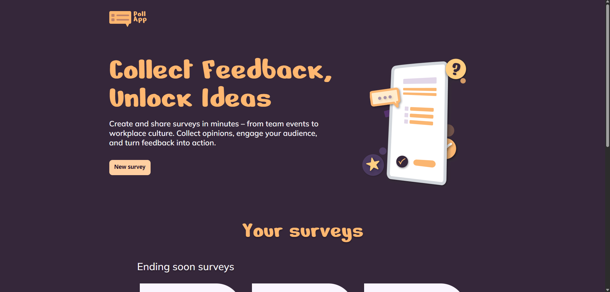
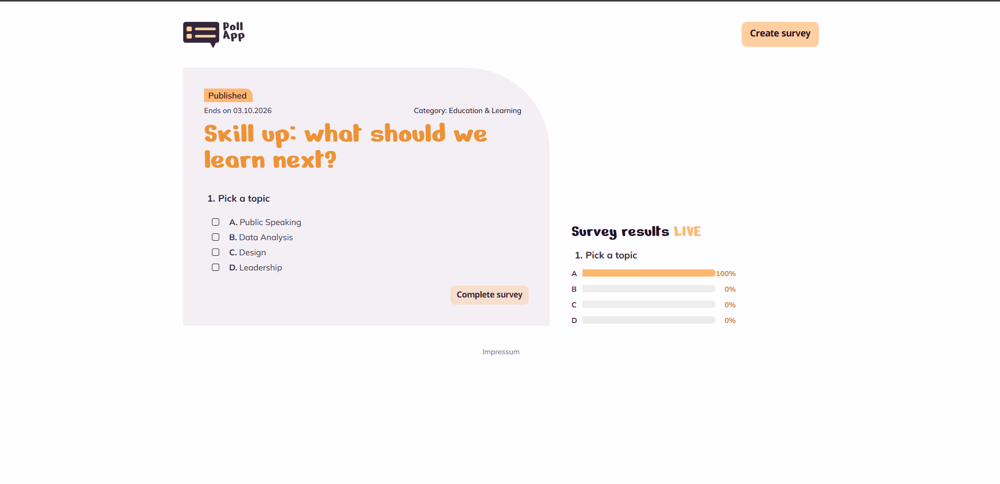

# PollApp

Umfragen erstellen, teilen und live Ergebnisse sehen.





## Funktionen

- **Startseite:** Umfragen, die bald enden, als Highlight-Karten, darunter alle Umfragen mit Filter nach Status (aktiv / beendet) und Kategorie
- **Umfrage erstellen:** Titel, Beschreibung, Kategorie, optionales Enddatum, beliebig viele Fragen mit 2–6 Antworten, Einfach- oder Mehrfachauswahl
- **Umfrage beantworten:** Antworten auswählen und absenden, beendete Umfragen sind gesperrt
- **Live-Ergebnisse:** Prozentwerte je Antwort, alle 5 Sekunden aktualisiert, inklusive Vorschau der eigenen Auswahl vor dem Absenden, auf Mobilgeräten ein- und ausklappbar
- **Impressum:** unter `/impressum`, verlinkt im Footer jeder Seite
- **Responsives Layout:** Desktop- und Mobile-Design nach Figma (Mobile-Layout unter 1100 px Breite)

## Tech-Stack

| Bereich | Technik |
|---|---|
| Frontend (`pollApp/`) | Angular 21 (Standalone Components, Signals), SCSS, Vitest |
| Datenbank | Supabase (Postgres), direkt aus dem Frontend über `@supabase/postgrest-js` |

Die App braucht keinen eigenen Server. Der Build besteht nur aus statischen Dateien und läuft auf jedem Webspace, auch in einem Unterordner.

## Struktur

```
pollApp/                  Angular-Frontend
  src/app/core/           Models und Datenbank-Zugriff (survey.service.ts, survey-db.ts)
  src/app/features/       Seiten: home, create-survey, survey-detail, imprint
  src/app/shared/         Wiederverwendbare Komponenten (Buttons, Karten, Dropdown, Icons …)
  src/environments/       Supabase-URL und Publishable Key
  src/styles/             Design-Tokens, Schriften, Icons, Breakpoints, Form-Mixins
  public/assets/          Logo, Illustrationen
supabase/policies.sql     Row-Level-Security-Regeln
```

## Setup

1. Supabase-Projekt anlegen und die Tabellen aus [Datenbank](#datenbank) erstellen.
2. Im SQL Editor von Supabase `supabase/policies.sql` ausführen.
3. In `pollApp/src/environments/environment.ts` die Projekt-URL und den **Publishable key** (`sb_publishable_…`) eintragen. Zu finden unter *Project Settings → API Keys*.

   > Niemals den **Secret key** (`sb_secret_…`) oder `service_role`-Key ins Frontend eintragen. Er umgeht alle Sicherheitsregeln und wäre für jeden Besucher lesbar.

4. Abhängigkeiten installieren und die App starten:
   ```bash
   cd pollApp
   npm install
   npm run serve
   ```
   Die App öffnet sich unter http://localhost:4200.

## Skripte (`pollApp/`)

| Befehl | Wirkung |
|---|---|
| `npm run serve` | Dev-Server starten und Browser öffnen |
| `npm run build` | Produktions-Build nach `dist/pollApp/browser/` (mit relativem `base href`) |
| `npm test` | Unit-Tests mit Vitest |

## Deployment

1. `npm run build` in `pollApp/` ausführen.
2. Den Inhalt von `pollApp/dist/pollApp/browser/` per FTP in den Zielordner hochladen, vorher alte Dateien dort löschen.
3. Damit Unterseiten wie `…/home` auch beim Neuladen funktionieren, muss der Server unbekannte Pfade auf `index.html` umleiten (bei Apache per `.htaccess`).

## Datenbank

Tabellen in Supabase:

| Tabelle | Spalten |
|---|---|
| `surveys` | `id` (uuid), `title`, `description`, `category`, `created_at`, `ends_at` |
| `questions` | `id` (uuid), `survey_id` → `surveys`, `text`, `position`, `allow_multiple` |
| `options` | `id` (uuid), `question_id` → `questions`, `text`, `position` |
| `responses` | `id` (uuid), `survey_id` → `surveys` |
| `response_answers` | `response_id` → `responses`, `question_id` → `questions`, `option_id` → `options` |

Die Regeln in `supabase/policies.sql` erlauben jedem Besucher, Umfragen zu lesen, anzulegen und abzustimmen. Ändern und Löschen ist nicht erlaubt.
